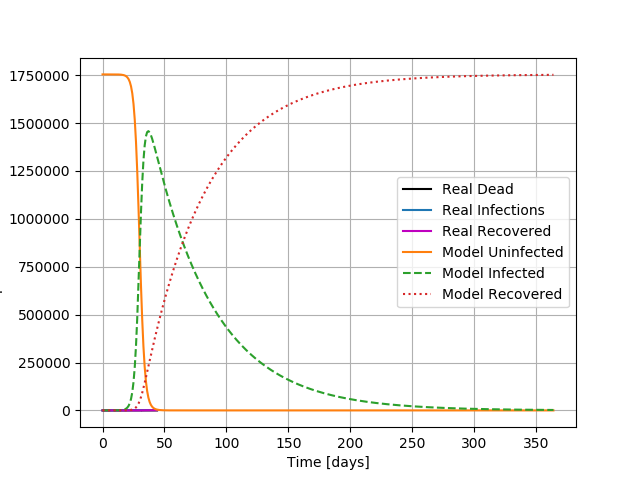

# Overview of Code
This code describes and models the current coronavirus (COVID-19) pandemic in the state of Idaho. With this, we hope to provide information on how well Idaho is dealing with COVID-19.

It models the pandemic in Idaho as a kinetic function of time in days, with equations that model the uninfected, infected, recovered, and deaths in Idaho.

# Software Requirements
This code requires access to a command line terminal and to have a github account to access the p2-kinetics repository and to be able to track and collaborate with other researchers on this topic. For this program to run, python must be installed on the local machine. To download Python, go to terminal, type in the command line "apt-get install python". This will start 
downloading Python onto the local machine. Your computer will ask a few permission questions and you will have to let it install Python onto the local machine.

The code also requires that numpy, matplotlib.pyplot, sys, and solve_iv to be imported. All the previously mentioned functions and numpy are part of bash and will run when the code is initiated. 

# How to Get This Code
To run the code on your computer, pull the p2-kinetics repository from github by cloning it, or fork the repository and pull the code from your own personal repository. 

## Example of how to get code
`$ git clone git@github.com:mse150s20/p2-kinetics.git` 

# How to Use This Code

To use this code you must be in the directory that contains the code. Type "$ python kinetics.py" + the path to the file that contains the data. 

# Example of how to use this code
`$ cd p2-kinetics/`

`$ python kinetics.py Data/idaho_infections.csv`

A plot will appear if everything is working correctly.

## Figures Showing Code Output

A graph of the number of infections vs time on a logarithmic scale. 

# File Descriptions
### idaho_infections.csv
The idaho_infections.csv file contains the reported numbers of the total reported infected people, deaths, and recoveries in Idaho. The file starts on the first day of reported cases in the state. It also includes the number of new cases of each designation. This csv file works in conjunction with kinetics.py as it will show the comparison of the reported data alongside with the projected data. 

### kinetics.py
This graph shows a prediction as well as the actual numbers of healthy, infected, recovered, and dead people.
### finding.py

### kinetics-dead.py
This graph shows a prediction of the number of healthy, infected, recovered, and dead people given constants of infection rate, recovery rate, and death rate.

### plot-infections.py
This graph shows the infection rate and the amount of dead people over the course of a year.

### kinetics-copy.py

### info.txt - SHOULD BE CLEANED UP
Project 2 descriptions:
    Modeling kinetics: rate of change between things!

    Healthy -> Infected -> Recovered

The rates of change between Healthy->Infected and Infected->Recovered will show us how quickly COVID-19 spreads and how quickly people can recover from COVID-19.

rInfect is the rate of Infection and rRecover is the rate of Recovery from Infection

Healthy: This is how many healthy uninfected people there are in Idaho.

Infected: This is the number of COVID-19 positive people there are in Idaho.

Recovered: This is the number of people who have recovered from a COVID-19 infection.

rInfect: This is a constant that is multiplied by the number of Healthy people. The product of Healthy times rInfect gives us the number of new Infections per day.
The equation for finding how many new infections per day is (rInfect*Healthy*Infected)/(Healthy+Infected+Recovered). Applying this tells us that initially when almost everyone is Healthy and very few are infected, the growth of infected is very slow. When Healthy and Infected are equal to each other is when the growth of infected is at its peak.

rRecover: This is a constant that is multiplied by the number of Infected people. The product of Infected time rRecover gives us the number of new Recovered people per day.
The rate at which people recover is completely dependent on how many infected people there are thus the equation for new Recovered is (rRecovered*Infected*). Applying this information tells us as the number of Infected people goes up, the number ofnew Recovered people will also go up. The peak of Recoveries will be when there the greatest number of Infected people.

# Conclusion
This is where we talk about what this data means for us. What are the next steps we need to take? Should we continue social distancing? Comment on how well the state is handling it. Etc...

### Playing team findings - NEED TO ELABORATE ON k1 and k2
A higher k1 is required to get the infection to ramp up in a similar timeframe to the real infections (i.e. smaller k1 = later beginning of mass infection). However, a k2 is needed to control the k1; it can't be too big or too small as to squash the infected graph, or to let it grow exponentially large. Finer tuning needed.

# References
1. Idaho Division of Public Health - https://public.tableau.com/profile/idaho.division.of.public.health#
  * This source contains data on the statewide cases in Idaho. It contains information on recovered, hospitalized, ICU admittances, and cases among health care workers. It also contains data on COVID-19 demographics and county data.

1. New York Times GitHub Repo -  https://raw.githubusercontent.com/nytimes/covid-19-data/master/us-states.csv
  * 

1. Idaho Statesman - https://www.idahostatesman.com/news/coronavirus/article242127516.html
  * 

1. KTVB 7 - https://www.ktvb.com/article/news/health/coronavirus/idaho-confirms-first-covid-19-coronavirus-case/277-262de30b-ef00-40a2-b40e-43e26f0bb99b
  * 

1. Centers for Disease Control and Prevention - https://www.cdc.gov/coronavirus/2019-ncov/cases-updates/summary.html#:~:text=On%20March%2011%2C%20the,of%20novel%20influenza%20viruses.
  * The CDC provides one of the most up to date information regarding the COVID-19 situation in the United States. It provides recommendations for what individuals and businesses should do as well as information on the risk and severity of COVID-19
